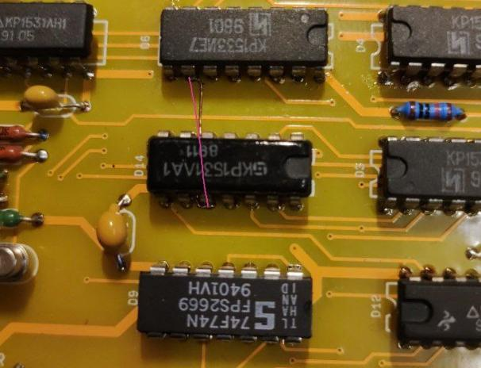
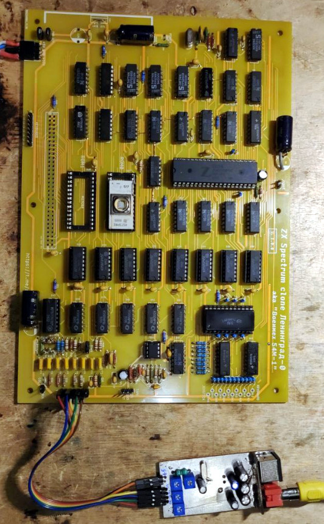

# 54М-1

## Российский клон компьютера ZX Spectrum

Данная реплика восстановлена по известным схемам, которые были найдены на форуме zx-pk.ru. К сожалению, в более-менее нормальном качестве
удалось найти только фотографии с верхней стороны печатной платы. Нижнюю сторону пришлось трассировать заново.

Есть несколько вариантов данной схемы. Эта более поздняя, с дополнительной микросхемой ТМ2, для возможности использования кварцевого резонатора на 14МГц.
Схема так же содержит параметрический стабилизатор на микросхеме КР142ЕН5 (LM7805). Диоды VD5-VD12 в оригинале расппаиваются на плате клавиатуры. Я их разместил
на обратной стороне основной платы в корпусах SMD, так же добавил разъем X8 для подключения клавиатуры. При желании, можно не запаивать не то и не другое и подключаться 
напрямую к контактам системного разъема. Системный разъем так же заменен с оригинального ГРПМ1-61 на современный  64-пиновый.

Информация по данному клону на форумах:

[zx-pk.ru](https://zx-pk.ru/threads/33139-leningrad-0-aka-voenmekh-54m-1.html)

[ruecm.forum2x2.ru](https://ruecm.forum2x2.ru/t1172-topic)

## Особенности:
- Z80 CPU на чатоте 3,5МГц
- Одно поле памяти 48k на микросхемах DRAM КР565РУ5.

[Принципиальная схема](Export/Schematic-54M-1_v1.0.2.pdf)

[Монтажная схема](Export/PCB_54M-1_v1.0.2.pdf)

[Чат Scorpion ZS & Ленинград в Telegram](https://t.me/zs_scorpion)

## Внимание!
__В первой версии платы (v1.0.0) обнаружены следующие ошибки.
* У микросхем D24 и D25 (ЛП10) перепутаны выводы питания 8 и 16. Проще всего, отогнуть данные выводы у микросхем и не запаивать их в отверстия, а подвести питание правильно отрезками провода МГТФ. Ошибку обнаружил VGalex.
* Нужно соединить выводы 10 микросхем D6 и D14. Обнаружили cmdzod и VGalex.

* Цвета на выходах RGB инвертированы. Микросхему D43 К555КП14 нужно заменить на К555КП16. Обнаружил VGalex.

В версии 1.0.2 данные недостатки уже устранены.

- Собрано уже, как минимум, два рабочих экземпляра платы (Ankor и VGAlex)!

Фотографии предоставил VGalex.

В схеме присутствуют доработки от VGAlex:
* Удлинен сигнал SYN за счет использования сигнала -H5, для более корректных таймингов 
* Конденсатор C1* установить и подобрать, если нужно сместить изображение влево.
* Конденсаторами C2* и C3* можно убрать вертикальную полосу на изображении слева, если она есть.